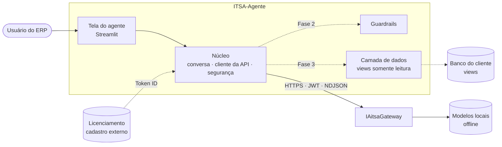
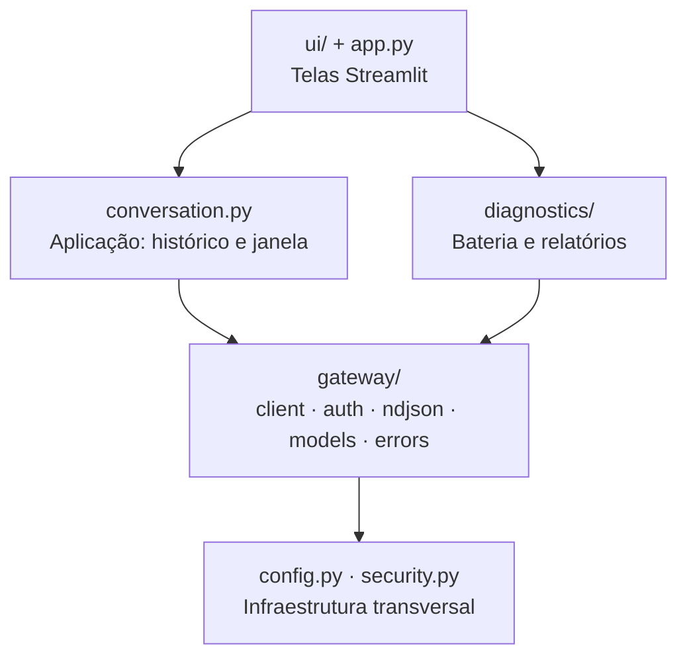
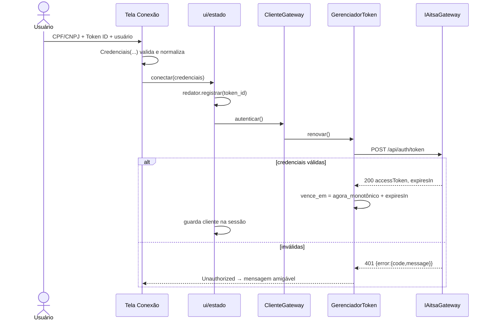
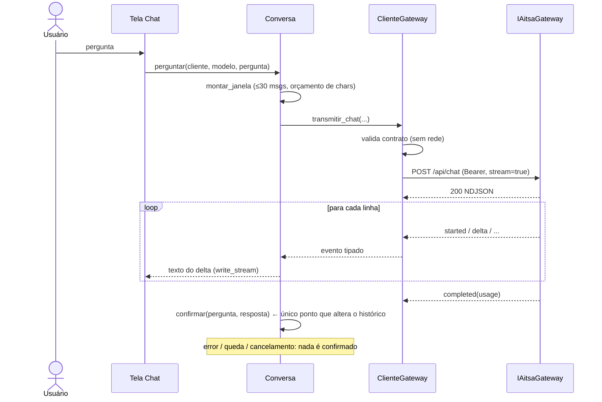

# 02 — Arquitetura

## 1. Visão de contexto



Linhas tracejadas são **fases futuras**. Na Fase 1, existem apenas: tela → núcleo → gateway.

## 2. Camadas e dependências



Regras de dependência (verificadas por revisão e pela ausência de ciclos de importação):

1. **Setas só descem.** `gateway/` não conhece `ui/` nem `conversation.py`.
2. `conversation.py` depende de um `Protocol` (`TransmissorChat`), não da classe concreta do
   cliente — o que permite dublês e, no futuro, outros provedores.
3. `ui/` não implementa protocolo: chama `ClienteGateway`/`Conversa`/`Diagnostico` e traduz
   exceções em mensagens (`ui/estado.py`).
4. `config.py` importa apenas `gateway.errors` (folha); `gateway/__init__.py` não reexporta nada,
   justamente para evitar ciclo `config → gateway → config`.

## 3. Estrutura de pastas

```
ITSA-Agente/
├── app.py                      # navegação Streamlit
├── itsa_agente/
│   ├── __init__.py             # __version__
│   ├── config.py               # Settings, .env
│   ├── conversation.py         # Conversa, JanelaContexto, TransmissorChat
│   ├── security.py             # Redator, FiltroRedacao, configurar_logging
│   ├── gateway/
│   │   ├── errors.py           # hierarquia GatewayError
│   │   ├── models.py           # contratos pydantic, Credenciais, eventos
│   │   ├── ndjson.py           # linha → evento; iterar_eventos
│   │   ├── auth.py             # GerenciadorToken
│   │   └── client.py           # ClienteGateway, RespostaSondagem
│   ├── diagnostics/
│   │   ├── modelos.py          # Status, Resultado, Observacao, Relatorio
│   │   ├── suite.py            # Diagnostico (D01–D19)
│   │   ├── relatorio.py        # Markdown/JSON redigidos
│   │   └── __main__.py         # CLI
│   └── ui/
│       ├── estado.py           # sessão, conectar/desconectar, texto_erro
│       └── pagina_*.py         # conexao, modelos, chat, diagnostico
├── tests/                      # gateway_falso.py + testes por módulo
└── docs/                       # SDD e ADRs
```

Estrutura prevista para as fases seguintes (**proposta**):

```
itsa_agente/
├── guardrails/                 # Fase 2: entrada, estrutura de prompt, saída, limites
├── dados/                      # Fase 3: catálogo de views, executor somente leitura, mascaramento
└── agentes/                    # Fases 4–6
    ├── base.py                 # contrato comum de agente
    ├── comercial/              #   agente.py · prompts/ · views.py · pagina.py
    ├── fiscal/
    └── contabil/
```

## 4. Fluxos principais

### 4.1 Conexão



### 4.2 Pergunta com streaming



### 4.3 Ciclo de vida do token

```mermaid
stateDiagram-v2
    [*] --> SemToken
    SemToken --> Valido: POST /api/auth/token (200)
    Valido --> Valido: uso normal
    Valido --> SemToken: agora ≥ vence_em − skew (renovação sob demanda)
    Valido --> SemToken: 401 em chamada autenticada (invalidar; 1 reemissão)
    SemToken --> [*]: fechar() descarta o token
```



## 5. Decisões de arquitetura (resumo)

| Tema | Decisão | ADR |
|---|---|---|
| Linguagem/UI | Python + Streamlit, executados direto da pasta | [0001](../adr/0001-python-e-streamlit.md) |
| HTTP | `httpx` síncrono, uma instância por sessão | [0002](../adr/0002-cliente-http-sincrono-httpx.md) |
| Prompt/contexto | Responsabilidade do cliente; `system` não é garantia | [0003](../adr/0003-engenharia-de-prompt-no-cliente.md) |
| Resiliência | Retentativa conservadora | [0004](../adr/0004-politica-de-retentativa.md) |
| Histórico | Só após `completed` | [0005](../adr/0005-historico-confirmado-apos-completed.md) |
| Token | Validade por `expiresIn` monotônico | [0006](../adr/0006-validade-do-token-por-expiresin.md) |
| Segredos | Só em memória; sempre mascarados | [0007](../adr/0007-segredos-somente-em-memoria.md) |
| Diagnóstico | Medir o gateway real | [0008](../adr/0008-diagnostico-como-produto.md) |
| Modularidade | Um módulo e uma tela por agente | [0009](../adr/0009-um-modulo-por-agente.md) |

## 6. Atributos de qualidade e como a arquitetura os atende

| Atributo | Tática |
|---|---|
| Segurança | Segredos em objeto dedicado (`Credenciais`) com `repr` mascarado; redação em logs e relatórios; validação local; estado por sessão |
| Confiabilidade | Retentativa só quando idempotente-segura; histórico transacional (confirmar ou descartar); erros tipados |
| Desempenho | Streaming ponta a ponta; cache curto de modelos; conexão HTTP reutilizada (`httpx.Client`) |
| Testabilidade | Transporte, relógio e espera injetáveis; gateway simulado fiel ao swagger |
| Evolução | Núcleo sem UI; `Protocol` para o cliente; pacote por agente (proposta) |
| Operabilidade | Diagnóstico embutido; relatórios anexáveis a chamados; mensagens com `código` e `requestId` |

## 7. Implantação

| Modo | Descrição | Quando usar | Observações |
|---|---|---|---|
| **A. Local (desenvolvimento)** | `iniciar.bat/.sh` na máquina do desenvolvedor | Desenvolvimento, demonstrações | Token digitado na tela |
| **B. Serviço interno (piloto)** | Um processo Streamlit em servidor da ITSA/cliente, atrás de proxy reverso com TLS e autenticação | Pilotos | O Streamlit **não tem autenticação própria**: nunca expor direto à internet |
| **C. Integrado ao ERP (alvo)** | O ERP abre a tela do agente (iframe/URL assinada) e fornece a identidade; o Token ID vem do banco do cliente via backend | Produção | Depende de decisões da Fase 7 ([08](08-roadmap.md)) |

Em B e C, cada **sessão de navegador** tem seu próprio `ClienteGateway` (estado em
`st.session_state`), portanto credenciais e histórico não se misturam entre usuários.

## 8. Limitações conhecidas da arquitetura atual

1. **Cliente síncrono**: cada sessão ocupa uma *thread* do Streamlit durante o streaming. Adequado
   para dezenas de sessões simultâneas; acima disso, avaliar serviço de backend assíncrono (FastAPI)
   com a UI como cliente — o núcleo já está separado para permitir essa troca.
2. **Sem persistência**: o histórico vive na sessão. Persistir conversas exige decisão de
   privacidade (conteúdo sensível) — ver [05](05-seguranca-e-guardrails.md).
3. **Sem cancelamento explícito no servidor**: fechar o iterador encerra a conexão do cliente; se
   o gateway interrompe a geração nesse caso é uma pergunta aberta (L-08).
