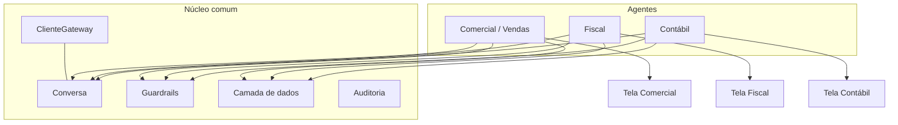
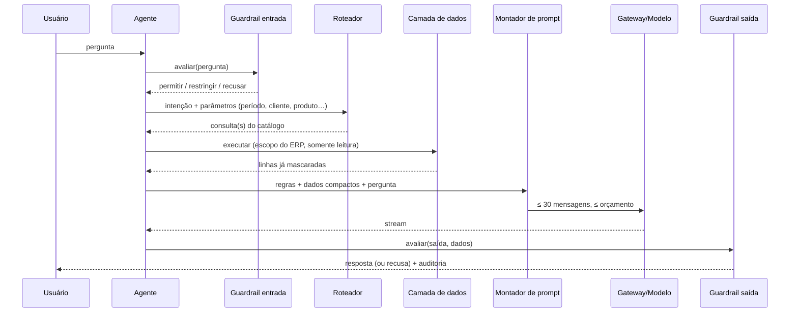

# 06 — Agentes e módulos

> **Estado:** proposta de arquitetura para as Fases 3–7. Nada deste documento está implementado na
> Fase 1, exceto o núcleo sobre o qual ele se apoia. O objetivo é fixar o desenho para que cada
> agente seja escrito **um por vez**, sem retrabalho do núcleo.

## 1. Conceito

Um **agente** é um especialista estreito, definido por dados e regras, executado sobre o núcleo
comum. Cada agente tem **sua tela** e pode ser **licenciado separadamente**. O acesso à API do
gateway é único.



## 2. Anatomia de um agente

| Elemento | O que define | Onde vive (proposta) |
|---|---|---|
| Identidade | `id`, nome, descrição, módulo de licença | `agentes/<id>/agente.py` |
| Escopo | Intenções permitidas e proibidas; mensagens de recusa | `agentes/<id>/escopo.py` |
| Prompt | Modelo de prompt (regras, persona, formato de saída, exemplos *few-shot*) | `agentes/<id>/prompts/*.md` |
| Fontes de dados | Consultas parametrizadas sobre *views* permitidas | `agentes/<id>/views.py` |
| Ferramentas determinísticas | Cálculos e verificações em código (ex.: totais, alíquotas tabeladas) | `agentes/<id>/ferramentas.py` |
| Guardrails | Cadeias de entrada/saída específicas | `agentes/<id>/guardrails.py` |
| Tela | Página Streamlit própria | `agentes/<id>/pagina.py` |
| Testes | Casos de qualidade e adversariais do agente | `tests/agentes/<id>/` |

Contrato comum (**proposta**):

```python
class Agente(Protocol):
    id: str
    modulo_licenca: str

    def atender(
        self, pergunta: str, contexto: ContextoUsuario, conversa: Conversa, cliente: TransmissorChat
    ) -> Iterator[str]: ...
```

## 3. Pipeline de um turno



## 4. Camada de dados (Fase 3)

### 4.1 Contrato de uma *view* no catálogo

| Campo | Descrição |
|---|---|
| `nome` | Nome da view no banco (somente `SELECT`) |
| `descricao` | Texto curto sobre o que representa (vai ao roteador, não ao usuário) |
| `colunas` | Colunas permitidas, tipo e **classificação** (`publico`, `interno`, `pessoal`, `sensivel`) |
| `filtros_obrigatorios` | Empresa, filial, usuário/vendedor — preenchidos **pelo ERP**, nunca pela conversa |
| `parametros` | Parâmetros aceitos, tipo, faixa e valor padrão (ex.: período ≤ 366 dias) |
| `limite_linhas` | Teto de linhas devolvidas |
| `mascaramento` | Regras por coluna (parcial, hash, remover) conforme o perfil |
| `agentes` | Quais agentes podem consultá-la |

### 4.2 Execução

1. Validar parâmetros contra o catálogo (tipos, faixas, listas permitidas).
2. Montar a consulta **parametrizada** (sem concatenação de texto livre).
3. Executar com usuário de banco **somente leitura**, com *timeout* e limite de linhas.
4. Mascarar e sanitizar (ver [05 §B.3](05-seguranca-e-guardrails.md)).
5. Converter para **representação compacta** (ver §5) e medir o tamanho antes de montar o prompt.

> Decisão pendente (D-04 em [08](08-roadmap.md)): tecnologia de acesso (ODBC/SQLAlchemy?), qual SGBD
> dos clientes, e se a execução ocorre no ITSA-Agente ou num serviço do lado do cliente.

## 5. Engenharia de contexto para modelos pequenos

O ganho de qualidade vem de **entregar ao modelo uma tarefa pequena, bem definida e já mastigada**.

| Técnica | Como aplicar |
|---|---|
| **Uma tarefa por chamada** | Separar "entender a pergunta", "buscar dados" e "redigir a resposta"; só a última exige geração de texto livre pelo modelo |
| **Pré-computar fatos** | Totais, médias, variações, rankings e comparativos calculados em código e entregues como fatos; o modelo **explica**, não calcula |
| **Representação compacta** | Tabelas em Markdown/CSV enxuto, nomes de coluna curtos, números já formatados em pt-BR, sem colunas irrelevantes |
| **Orçamento de contexto** | Reservar fatias fixas: regras (~15 %), dados (~60 %), histórico (~15 %), pergunta (~10 %); medir caracteres/token com D19 |
| **Recuperação seletiva** | Para base de conhecimento (legislação, manuais): trazer só os trechos relevantes (busca lexical/BM25 primeiro; vetores só se necessário) |
| **Resumo rolante** | Quando o histórico excede a janela, resumir turnos antigos em fatos estruturados em vez de descartar |
| **Saída restrita** | Seções fixas ou JSON curto; *few-shot* com 1–3 exemplos reais do domínio |
| **Rótulos e unidades** | Sempre indicar período, moeda, empresa e fonte nos dados entregues |
| **Perguntas de esclarecimento** | Se faltar parâmetro (período, filial), perguntar antes de consultar |
| **Temperatura baixa** | Não é ajustável pela API atual (L-07); a estrutura rígida compensa |

## 6. Catálogo de agentes planejados

### 6.1 Comercial / Vendas (primeiro agente — recomendação)

- **Por que primeiro:** menor risco regulatório, maior valor imediato, dados bem estruturados.
- **Perguntas típicas:** vendas do mês por vendedor/produto/região; ticket médio; comparativos;
  clientes inativos; pedidos em aberto; estoque disponível para um item; status de um pedido;
  previsão de reposição.
- **Dados (exemplos hipotéticos):** `vw_vendas_resumo`, `vw_pedidos_aberto`, `vw_estoque_saldo`,
  `vw_clientes_ativos`. *Os nomes reais dependem do ERP.*
- **Regras:** vendedor só vê a própria carteira (salvo perfil gerente); preços e margens conforme
  perfil; nunca inventar dados ausentes ("não encontrei").
- **Riscos:** vazamento entre vendedores/filiais (G-T5); margem e custo são dados sensíveis.
- **Atendimento comercial** (subespecialidade): foco em consulta de pedido/entrega/histórico de
  cliente e respostas padronizadas; pode ser um segundo agente reutilizando as mesmas views.

### 6.2 Fiscal

- **Perguntas típicas:** situação de notas (autorizadas/canceladas/denegadas), pendências de
  obrigações, conferência de CFOP/CST/NCM de um item, resumo de impostos do período, explicar uma
  rejeição da SEFAZ.
- **Regras críticas:**
  - **O modelo não calcula tributos.** Cálculos e alíquotas vêm de tabelas/regras em código ou do
    próprio ERP; o modelo apresenta e explica.
  - O modelo local **não conhece a legislação vigente**. Conteúdo normativo vem de uma **base
    versionada** (com data de vigência e fonte), recuperada seletivamente; sem base, o agente
    informa que não pode afirmar.
  - Respostas citam a **origem** (consulta/período/documento) e trazem aviso de conferência.
- **Riscos:** G-T6 (manipulação de números), resposta desatualizada, falsa certeza.
- **Dados (exemplos):** `vw_nfe_resumo`, `vw_apuracao_icms`, `vw_itens_fiscais`.

### 6.3 Contábil

- **Perguntas típicas:** saldo e movimento de contas, balancete por período, conciliações
  pendentes, lançamentos de um documento, variação entre períodos, DRE resumida.
- **Regras críticas:** valores sempre vindos das views; conferência numérica obrigatória na saída;
  nunca "arredondar" por conta própria; deixar explícito período, empresa e plano de contas.
- **Riscos:** G-T6, sigilo contábil, perfil de acesso por centro de custo/empresa.
- **Dados (exemplos):** `vw_balancete`, `vw_razao`, `vw_lancamentos`.

## 7. Modularidade e licenciamento

| Aspecto | Desenho (proposta) |
|---|---|
| Unidade de venda | **Módulo = agente + tela** (ex.: "Comercial", "Fiscal") |
| Habilitação | Lista de módulos ativos por cliente. Hoje o contrato do gateway **não informa** módulos (L-09); fontes possíveis: (a) o ERP informa a lista; (b) *claim* no JWT, se o licenciamento passar a emiti-la; (c) arquivo de configuração por cliente |
| Aplicação | `app.py` monta `st.navigation` somente com as páginas dos módulos ativos; o agente verifica a licença também no servidor (não só esconder a tela) |
| Núcleo | Único para todos os módulos; atualizações de segurança beneficiam todos |
| Telas | Uma por agente, com identidade visual do ERP; sem chat genérico |
| Demanda/MVP | Cada agente é entregue e validado isoladamente, gerando casos de uso para venda |

## 8. Qualidade e avaliação dos agentes

- **Conjunto de perguntas de ouro** por agente (50–100), com resposta esperada derivada dos dados;
  métricas: acerto numérico, taxa de recusa correta, taxa de alucinação, latência.
- **Revisão por especialista de domínio** (fiscal/contábil) antes de liberar.
- **Regressão**: o conjunto roda a cada alteração de prompt/modelo; mudar de modelo no gateway
  exige reavaliação.
- **Feedback do usuário** (👍/👎 com categoria, sem conteúdo) para priorizar correções.

## 9. Ordem sugerida e critérios de entrada

1. Fase 2 (guardrails) e Fase 3 (dados) **antes** do primeiro agente.
2. Agente Comercial → Atendimento comercial → Fiscal → Contábil.
3. Um agente só entra em produção com: corpus adversarial aprovado, isolamento de dados testado,
   perguntas de ouro acima da meta e revisão de segurança.
