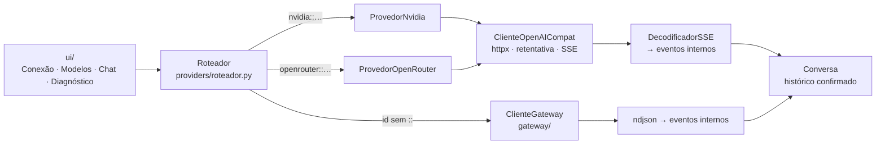
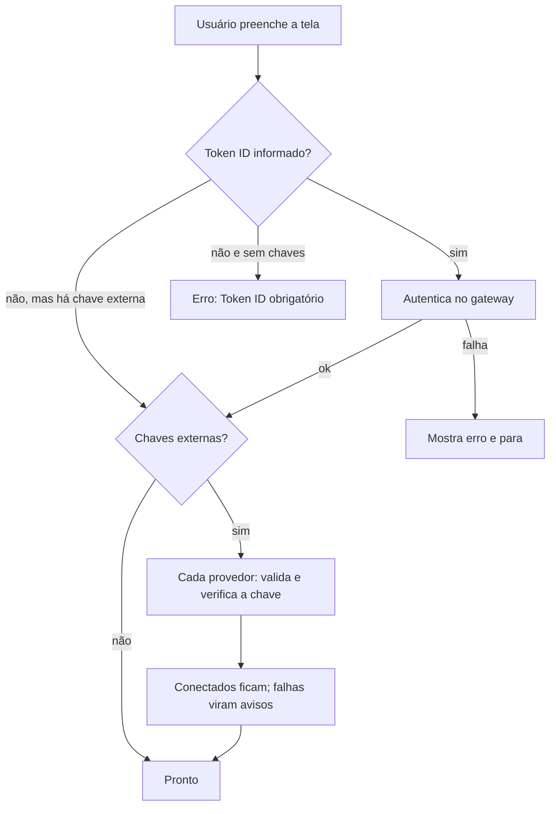

# 11 — Provedores externos (NVIDIA e OpenRouter)

> Complementa o [03](03-contrato-api-gateway.md) (gateway ITSA). Decisão registrada no
> [ADR-0010](../adr/0010-provedores-externos-e-roteamento.md). Estado: **implementado** e testado
> contra um provedor simulado; o comportamento **real** é medido pelo diagnóstico P01–P09 (§9) —
> as fontes abaixo são as páginas dos próprios provedores, consultadas em 08/10/2026.

## 1. Objetivo e escopo

Permitir, no mesmo projeto e na mesma tela de conexão, chamar modelos **além** dos locais do
gateway, para ajustar **tráfego, qualidade e peso das respostas** e comparar modelos por agente.

| Dentro do escopo | Fora do escopo (por ora) |
|---|---|
| Conexão com chave de API digitada (memória) | Persistência de chaves (arquivo, banco, cofre) |
| Catálogo unificado de modelos | Cobrança/limite de gasto por cliente |
| Chat de teste com roteamento por modelo | Modelo fixo por agente (vem com os agentes — Fase 4) |
| Raciocínio separado da resposta | *Tool calling*, visão, áudio, JSON *schema* |
| Diagnóstico P01–P09 e relatório | Política de sensibilidade de dados (decisão do produto: sem restrição) |

## 2. Origens de modelos

| Origem | `id` | Base URL | Autenticação | Protocolo | Modelos |
|---|---|---|---|---|---|
| IAitsaGateway | `itsa` | `ITSA_BASE_URL` | JWT (Token ID → `/api/auth/token`) | NDJSON próprio | `iaitsa-geral`, `iaitsa-suporte` |
| NVIDIA | `nvidia` | `https://integrate.api.nvidia.com/v1` | `Authorization: Bearer nvapi-…` | OpenAI *chat completions*, SSE | `nvidia/nemotron-3-ultra-550b-a55b` e qualquer outro ID do catálogo |
| OpenRouter | `openrouter` | `https://openrouter.ai/api/v1` | `Authorization: Bearer sk-or-…` | OpenAI *chat completions*, SSE | Catálogo vivo (`GET /models`), gratuitos primeiro |

**Identificador de modelo (qualificado):** `provedor::id_no_provedor`. Sem `::` → gateway ITSA.
Exemplos: `iaitsa-geral` · `nvidia::nvidia/nemotron-3-ultra-550b-a55b` ·
`openrouter::nvidia/nemotron-3-ultra-550b-a55b:free`.

## 3. Contrato usado (API compatível com a da OpenAI)

Requisição (`POST {base}/chat/completions`):

```json
{
  "model": "…",
  "messages": [{"role": "system|user|assistant", "content": "…"}],
  "stream": true,
  "max_tokens": 8192,
  "stream_options": {"include_usage": true},
  "temperature": 0.2
}
```

`temperature` só é enviado se definido; `max_tokens` vem de `ITSA_PROVIDER_MAX_TOKENS` (inclui o
raciocínio). Mais os campos específicos de cada provedor (§4).

Resposta (SSE, `Content-Type: text/event-stream`):

```
: OPENROUTER PROCESSING                                  ← comentário keep-alive: ignorado
data: {"id":"…","model":"…","choices":[{"delta":{"content":"Olá"}}]}
data: {"choices":[{"delta":{"reasoning_content":"…"}}]}   ← raciocínio (NVIDIA)
data: {"choices":[{"delta":{},"finish_reason":"stop"}]}
data: {"choices":[],"usage":{"prompt_tokens":20,"completion_tokens":4}}
data: [DONE]
```

### 3.1 Mapeamento para os eventos internos

| SSE | Evento interno |
|---|---|
| Primeiro objeto de dados | `EventoIniciado(request_id=id, model)` |
| `delta.content` (não vazio) | `EventoDelta` |
| `delta.reasoning_content` ou `delta.reasoning` | `EventoRaciocinio` (separado; nunca no histórico) |
| `finish_reason` + `usage` + `[DONE]` | `EventoConcluido(usage, motivo)` |
| Objeto com `error` / `finish_reason="error"` | `EventoErro` (terminal) |
| `Content-Type: application/json` (provedor ignorou `stream`) | Eventos equivalentes a partir da resposta única |
| Fim da conexão **sem** `[DONE]` **e sem** `finish_reason` | `StreamInterrupted` (nada entra no histórico) |
| Fim limpo da conexão **após** `finish_reason`, sem `[DONE]` | `EventoConcluido` (texto íntegro) |

`motivo = "length"` significa resposta cortada pelo limite de tokens; a tela avisa.

### 3.2 Erros (HTTP)

| HTTP | Exceção | Mensagem ao usuário (resumo) |
|---|---|---|
| 400 / 404 / 422 | `BadRequest` | "{provedor} recusou a requisição: …" (ex.: modelo inexistente) |
| 401 | `Unauthorized` | "A chave de API de {provedor} foi recusada (inválida, revogada ou expirada)…" |
| 402 | `CreditoInsuficiente` | "Créditos ou cota esgotados em {provedor}…" |
| 403 | `Forbidden` | "{provedor} negou o acesso (chave sem permissão ou política do provedor)." |
| 408 | `RequestTimeout` | "{provedor} demorou demais para responder." |
| 429 | `RateLimited` | "Limite de requisições atingido. Tente novamente em Ns." |
| 502 / 503 / 504 | `ServiceUnavailable` | "{provedor} está indisponível ou instável…" (após retentativas) |
| outros 5xx | `ServerError` | idem |

Formatos de corpo de erro aceitos: `{"error":{"message","type","code"}}`, `{"error":"texto"}`,
`{"detail":"…"}`, `{"title":"…"}`, texto puro. Mensagens são **truncadas a 300 caracteres e
redigidas** (provedores podem ecoar trechos da requisição).

## 4. Particularidades por provedor

### 4.1 NVIDIA (build.nvidia.com)

| Tema | Fato (fonte: página do modelo e docs de integração) | Decisão no projeto |
|---|---|---|
| Endpoint | `https://integrate.api.nvidia.com/v1`, cliente OpenAI | `ITSA_NVIDIA_BASE_URL` |
| Chave | Gerada em "Generate API Key"; formato `nvapi-…` | Digitada na tela; só memória |
| Modelo | `nvidia/nemotron-3-ultra-550b-a55b`; MoE híbrido Mamba-Transformer, 550B totais / 55B ativos, contexto de 1 M tokens, só texto | Lista curta em `ITSA_NVIDIA_MODELS`; a tela aceita qualquer outro ID |
| Raciocínio | `chat_template_kwargs: {"enable_thinking": true}`; chega em `delta.reasoning_content` | Desligado por padrão (`enable_thinking=false`, `force_nonempty_content=true`); só enviado a modelos `nemotron-3` |
| `GET /v1/models` | **Público** (responde sem chave) | Não serve para validar a chave |
| Validação da chave | — | Conversa de 1 token (`max_tokens=1`); só 401/403 e 5xx reprovam |
| Limites / termos do endpoint gratuito | **Não documentados** na página do modelo (só links para a política de privacidade) | **Lacuna L-13**: consultar a NVIDIA; tratar como serviço de teste |

### 4.2 OpenRouter

| Tema | Fato (fonte: docs do OpenRouter) | Decisão no projeto |
|---|---|---|
| Endpoint | `https://openrouter.ai/api/v1/chat/completions` | `ITSA_OPENROUTER_BASE_URL` |
| Identificação do app | `HTTP-Referer` (URL) e `X-Title` opcionais | `ITSA_OPENROUTER_REFERER`, `ITSA_OPENROUTER_TITLE` (padrão `ITSA-Agente`) |
| Keep-alive SSE | Comentários `: OPENROUTER PROCESSING` | Ignorados |
| Erro no meio do stream | `data: {"error":{…}}` com `finish_reason:"error"` | Vira `EventoErro` |
| Uso de tokens | Um objeto `usage` ao final, com `choices` vazio; contagem normalizada | Lido e exibido |
| Catálogo | `GET /models`: `id`, `name`, `context_length`, `pricing.prompt/completion` (**strings**), `architecture.output_modalities`, `supported_parameters`, `reasoning{mandatory,default_enabled}` | Lista só modelos com saída `text`; gratuitos (`pricing` 0) primeiro; cache de 10 min |
| Validação da chave | `GET /key` exige a chave e informa `free_model_daily_requests` | Usado; mostra "modelos gratuitos hoje: n/limite" na Conexão |
| Raciocínio | `reasoning: {"enabled": bool}` | Só enviado se o usuário escolher "Ligado"/"Desligado" |
| Privacidade | `provider.data_collection: "deny"`; `zdr`; configuração global em openrouter.ai/settings/privacy | Opcional: `ITSA_OPENROUTER_DATA_COLLECTION=deny` (padrão: não enviar) |
| Limites dos modelos `:free` | 20 req/min; 50 req/dia (< 10 créditos comprados) ou 1000/dia (≥ 10) | Exibidos na Conexão; `429` informa a espera |
| Erros específicos | `402` (créditos), `429`, `502` (provedor caiu) | Tipados (§3.2) |

## 5. Arquitetura



| Módulo | Responsabilidade |
|---|---|
| `providers/base.py` | `OpcoesGeracao`, `ModeloCatalogo`, `qualificar`/`separar` |
| `providers/sse.py` | `DecodificadorSSE` (linha → eventos; sem I/O) |
| `providers/erros.py` | Corpo de erro → `(código, mensagem)`; status → exceção |
| `providers/openai_compat.py` | Cliente HTTP: retentativa, streaming, `stream_options`, `sondar` |
| `providers/nvidia.py`, `openrouter.py` | Particularidades (§4), catálogo, verificação da chave |
| `providers/fabrica.py` | `criar_provedor(id, chave, cfg)` |
| `providers/roteador.py` | `Roteador`, `Catalogo` (falhas isoladas por origem) |
| `diagnostics/provedores.py` | `DiagnosticoProvedor` (P01–P09) |

`Roteador.opcoes` (`OpcoesGeracao`) leva `raciocinio`, `temperatura` e `max_tokens` às chamadas
externas; o gateway não aceita parâmetros de geração e os ignora (D17).

## 6. Fluxo de conexão



Provedores são **independentes**: um que falha não derruba o outro nem o gateway. Depois de
conectado, a própria tela de Conexão permite adicionar ou remover provedores.

## 7. Raciocínio (*thinking*)

- Chega como `EventoRaciocinio`, **separado** da resposta; `Conversa` o guarda em
  `ultimo_raciocinio` e exibe em um *expander* "Raciocínio do modelo".
- **Nunca** entra no histórico reenviado ao modelo (evita crescimento de contexto e vazamento).
- Se o modelo gasta o limite de tokens raciocinando e não produz resposta, a tela avisa e a
  interação não é guardada.

## 8. Segurança das chaves

Ver [05 §A.4](05-seguranca-e-guardrails.md). Resumo: memória apenas; `repr` sem chave; registro no
redator global; padrões `nvapi-…`/`sk-or-…` mascarados mesmo sem registro; o rótulo da chave devolvido
pelo OpenRouter (fragmento da própria chave) é descartado; relatórios sempre redigidos.

## 9. Diagnóstico de provedores (P01–P09)

| ID | Verificação | Resultado esperado |
|---|---|---|
| P01 | Chave aceita e catálogo | OK; quantidade de modelos; escolhe um gratuito se o modelo não foi dado |
| P02 | Chat mínimo | `started→delta→completed`; uso de tokens; `finish_reason=stop`; latências |
| P03 | UTF-8 | Acentuação íntegra |
| P04 | `role=system` obedecido | Responde só "BANANA" |
| P05 | Streaming incremental e **vazão de geração** | > 2 trechos; tokens/s calculado do 1º trecho ao fim |
| P06 | Raciocínio ligado × desligado | Compara caracteres de raciocínio, tokens e tempo |
| P07 | Chave inválida é rejeitada | 401/403 (ALERTA se aceitar) |
| P08 | Modelo inexistente é rejeitado | 400/404/422 |
| P09 | Contexto longo — "agulha no palheiro" (opcional) | Recupera um código escondido a ~10 % do início em 24 mil e 96 mil caracteres; detecta corte silencioso |

O relatório (Markdown/JSON) tem o mesmo formato do gateway: veredito, tabela, **catálogo de erros
com corpo bruto** e dados medidos.

## 10. Configuração

| Variável | Padrão | Descrição |
|---|---|---|
| `ITSA_NVIDIA_BASE_URL` | `https://integrate.api.nvidia.com/v1` | Base da API da NVIDIA (ou de um NIM próprio) |
| `ITSA_NVIDIA_MODELS` | `nvidia/nemotron-3-ultra-550b-a55b` | Lista (vírgula/ponto e vírgula) de modelos oferecidos |
| `ITSA_OPENROUTER_BASE_URL` | `https://openrouter.ai/api/v1` | Base da API do OpenRouter |
| `ITSA_OPENROUTER_REFERER` | *(vazio)* | Cabeçalho `HTTP-Referer` |
| `ITSA_OPENROUTER_TITLE` | `ITSA-Agente` | Cabeçalho `X-Title` |
| `ITSA_OPENROUTER_DATA_COLLECTION` | *(vazio)* | `deny` pede só provedores que não coletam dados; `allow` explícito |
| `ITSA_PROVIDER_MAX_TOKENS` | `8192` | Teto de tokens de saída (inclui raciocínio) |

**Chaves de API não têm variável de ambiente nem `.env`:** são digitadas na tela (decisão do ADR-0010).
Os tempos e a política de retentativa são os mesmos do gateway (`ITSA_CONNECT_TIMEOUT`,
`ITSA_REQUEST_TIMEOUT`, `ITSA_STREAM_READ_TIMEOUT`, `ITSA_MAX_RETRIES`).

## 11. Lacunas e medições pendentes

| ID | Lacuna | Como fechar |
|---|---|---|
| L-13 | Limites de taxa, cota e termos de uso de dados do endpoint gratuito da NVIDIA | Documentação/contrato da NVIDIA; observar `429` |
| L-14 | A NVIDIA aceita `stream_options.include_usage`? | P02 (se não, o cliente repete sem o campo e o uso fica indisponível) |
| L-15 | `enable_thinking` e `force_nonempty_content` têm o efeito esperado no endpoint gratuito? | P06 |
| L-16 | Quais modelos do OpenRouter suportam `reasoning.enabled`? | `supported_parameters` do catálogo (não usado ainda) + P06 |
| L-17 | Qualidade comparada (locais × externos) por agente | Bateria de perguntas de ouro (06 §8), às cegas |
| L-18 | Latência e vazão reais dos externos vistos do servidor da ITSA | P02/P05 a partir da rede de produção |

> **Limite honesto:** os testes automatizados usam um provedor **simulado** que reproduz o formato
> documentado. Rodar P01–P09 com chaves reais é o que confirma o comportamento de verdade.
